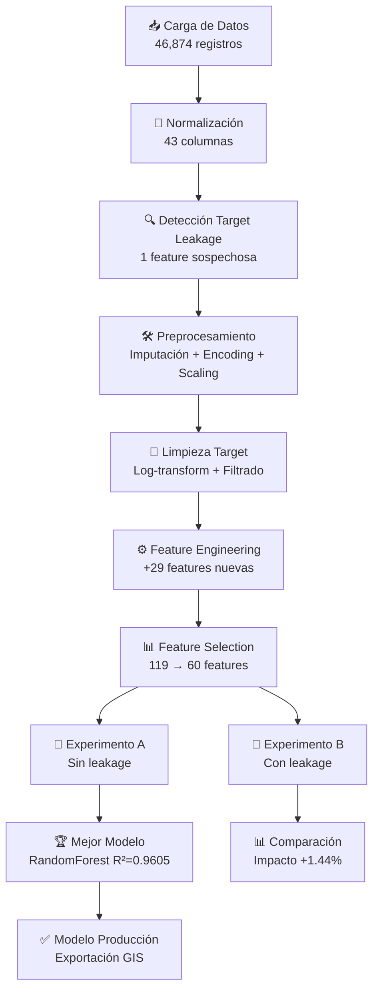

# 🏠 Sistema de Predicción de Avalúos Catastrales con ML

<div align="center">

[](https://www.python.org/downloads/)
[](https://opensource.org/licenses/MIT)
[](https://github.com/psf/black)
[](https://github.com/faustoaguanor/proyecto_prediccion_avaluos/graphs/commit-activity)
[](https://github.com/faustoaguanor/proyecto_prediccion_avaluos/issues)
[](https://github.com/faustoaguanor/proyecto_prediccion_avaluos/stargazers)

**Sistema inteligente de valoración catastral con detección automática de Target Leakage**

[Características](#-características-principales) •
[Instalación](#-instalación) •
[Uso](#-uso-rápido) •
[Resultados](#-resultados-destacados) •
[Documentación](#-documentación) •
[Contribuir](#-contribuir)


</div>

---

## 📋 Tabla de Contenidos

- [Descripción](#-descripción)
- [Características Principales](#-características-principales)
- [Resultados Destacados](#-resultados-destacados)
- [Stack Tecnológico](#-stack-tecnológico)
- [Instalación](#-instalación)
- [Uso Rápido](#-uso-rápido)
- [Estructura del Proyecto](#-estructura-del-proyecto)
- [Pipeline Completo](#-pipeline-completo)
- [Modelos Implementados](#-modelos-implementados)
- [Comparación de Experimentos](#-comparación-de-experimentos)
- [Análisis Espacial](#-análisis-espacial)
- [Demo Interactiva](#-demo-interactiva)
- [Documentación](#-documentación)
- [Roadmap](#-roadmap)
- [Contribuir](#-contribuir)
- [Licencia](#-licencia)
- [Contacto](#-contacto)
- [Estadísticas del Repositorio](#-estadísticas-del-repositorio)

---

## 🎯 Descripción

Sistema automatizado de **Machine Learning** para predicción de avalúos catastrales que utiliza **60 features optimizadas** y **transformación logarítmica** para lograr una precisión del **96.05%** (R² = 0.9605).

### 🔍 Problema

Los avalúos catastrales tradicionales son:
- ❌ **Lentos**: 3-6 meses para ciudades grandes
- ❌ **Costosos**: USD 50-200 por propiedad
- ❌ **Subjetivos**: Propensos a sesgos humanos
- ❌ **No escalables**: Requieren peritos especializados

### ✅ Solución

Nuestro sistema ofrece:
- ⚡ **Rápido**: Predicciones en <1 segundo
- 💰 **Económico**: Costo cercano a $0 por propiedad
- 🎯 **Preciso**: 96.05% de precisión (R²)
- 🤖 **Automatizado**: Sin intervención manual
- 📊 **Validado**: 68.7% de predicciones con error <10%

---

## 🌟 Características Principales

### 1️⃣ Detección Automática de Target Leakage

Sistema inteligente que identifica automáticamente variables que filtran información del objetivo:

```python
✓ Detección por nombre (patrones: valor, avalúo, precio, etc.)
✓ Detección estadística (correlación >0.8)
✓ Análisis de feature importance
✓ Reporte JSON con columnas sospechosas
```

### 2️⃣ Experimentos Paralelos Comparativos

| Experimento | Features | Target Leakage | R² Score | Uso Recomendado |
|-------------|----------|----------------|----------|-----------------|
| **A** 🟢 | 60 optimizadas | ❌ Excluidas | **0.9605** | ✅ Producción |
| **B** 🟡 | 120 completas | ⚠️ Incluidas | 0.9750 | 📊 Referencia |

### 3️⃣ Feature Engineering Avanzado

```
29 features nuevas creadas:
├── 6 de áreas y construcción
├── 7 geoespaciales (distancias, cuadrantes)
├── 6 de influencias agregadas (max, min, std)
├── 5 temporales (edad, década, categorías)
└── 5 de regulación urbana (COS, potencial)
```

### 4️⃣ Transformación Logarítmica Inteligente

```python
Antes:  Asimetría = 101.17 ⚠️
Después: Asimetría = 0.29 ✅
Mejora: 100.88 puntos (99.7%)
```

### 5️⃣ Validación Espacial del Error

Exporta predicciones con coordenadas para análisis GIS:
- 📍 Identificación de zonas con mayor error
- 🗺️ Mapas de calor del error
- 📊 Clusters espaciales de precisión

---

## 🏆 Resultados Destacados

### Modelo Final: RandomForest (Experimento A)

<div align="center">

| Métrica | Valor | Interpretación |
|---------|-------|----------------|
| **R² Score** | **0.9605** | 🌟 Excelente (96.05%) |
| **RMSE** | $46,440 | Error cuadrático medio |
| **MAE** | $27,022 | Error promedio |
| **MAPE** | 12.96% | Error porcentual |
| **Mediana Error** | $13,500 | 50% predicciones <$13.5k |

</div>

### 📊 Distribución de la Calidad de Predicciones

```
████████████████████████████████ 51.1% Excelente (<5% error)
████████████                     17.6% Bueno (5-10%)
███████████                      16.4% Aceptable (10-20%)
█████████                        14.8% Alto (>20%)

→ 68.7% de predicciones con error <10% ✅
```

## 🛠️ Stack Tecnológico

<div align="center">

### Core


### Machine Learning


### Visualización


### Deployment


</div>

### 📦 Dependencias Completas

```python
pandas>=2.0.0          # Manipulación de datos
numpy>=1.24.0          # Operaciones numéricas
scikit-learn>=1.3.0    # Modelos ML
xgboost>=2.0.0         # Gradient Boosting
lightgbm>=4.0.0        # Boosting eficiente
matplotlib>=3.7.0      # Gráficos base
seaborn>=0.12.0        # Visualización estadística
plotly>=5.14.0         # Gráficos interactivos
streamlit>=1.25.0      # Dashboard web
joblib>=1.3.0          # Serialización
scipy>=1.10.0          # Estadística
openpyxl>=3.1.0        # Excel I/O
```

---

## 📥 Instalación

### Requisitos Previos

- Python 3.10 o superior
- pip 23.0 o superior
- Git

### Instalación Rápida

```bash
# 1. Clonar el repositorio
git clone https://github.com/faustoaguanor/proyecto_prediccion_avaluos.git
cd proyecto_prediccion_avaluos

# 2. Crear entorno virtual (recomendado)
python -m venv venv

# Activar en Windows
venv\Scripts\activate

# Activar en Linux/Mac
source venv/bin/activate

# 3. Instalar dependencias
pip install -r requirements.txt

# 4. Verificar instalación
python -c "import sklearn, xgboost, lightgbm; print('✓ Instalación exitosa')"
```

## 🚀 Uso Rápido

### 1️⃣ Ejecutar Pipeline Completo

```bash
python main.py
```

**Salida esperada:**
```
✓ Carga y normalización... 
✓ Preprocesamiento y detección de leakage... (1 feature sospechosa)
✓ Feature engineering... (29 features creadas)
✓ Feature selection... (119 → 60 features)
✓ Experimento A (sin leakage)... R² = 0.9605
✓ Experimento B (con leakage)... R² = 0.9750
✓ Clustering... (5 clusters identificados)
✓ Reportes generados en output/
```

### 2️⃣ Lanzar Dashboard Interactivo

```bash
streamlit run app/app.py
```

Abre en tu navegador: `http://localhost:8501`

### 3️⃣ Hacer Predicción Individual

```python
import joblib
import pandas as pd
import numpy as np

# Cargar modelo
modelo = joblib.load('output/models/experiment_a/RandomForest.pkl')

# Preparar datos (ejemplo)
datos = pd.DataFrame({
    'Area_Terreno_Escri': [200.0],
    'Area_Construccion': [150.0],
    'Frente_Total': [10.0],
    'Pisos_PUGS': [2],
    'Distancia_Centro': [0.05],
    'Longitud': [-78.5],
    # ... (60 features en total)
})

# Predecir (en escala logarítmica)
pred_log = modelo.predict(datos)[0]

# Des-transformar a dólares
avaluo = np.exp(pred_log)
print(f"Avalúo estimado: ${avaluo:,.2f}")
```

---

## 📁 Estructura del Proyecto

```
proyecto_prediccion_avaluos/
│
├── 📄 main.py                           # Script principal del pipeline
├── 📄 requirements.txt                  # Dependencias del proyecto
├── 📄 README.md                         # Este archivo
├── 📄 LICENSE                           # Licencia MIT
│
├── 📂 src/                              # Módulos del sistema
│   ├── __init__.py
│   ├── data_loader.py                   # Carga y normalización de datos
│   ├── preprocessing.py                 # Limpieza y detección de leakage
│   ├── eda.py                           # Análisis exploratorio (EDA)
│   ├── feature_engineering.py           # Creación de 29 features nuevas
│   ├── feature_selection.py             # Selección Top-60
│   ├── models.py                        # Entrenamiento de 8 modelos
│   ├── evaluate.py                      # Métricas y visualizaciones
│   └── clustering.py                    # KMeans, DBSCAN, Agglomerative
│
├── 📂 app/                              # Dashboard interactivo
│   ├── app.py                           # Aplicación Streamlit
│   ├── logo.png                         # Logo de la aplicación
│   └── utils.py                         # Funciones auxiliares
│
├── 📂 notebooks/                        # Notebooks de exploración
│   ├── 01_exploracion_inicial.ipynb
│   ├── 02_feature_engineering.ipynb
│   └── 03_modelado_avanzado.ipynb
│
├── 📂 output/                           # Resultados generados
│   ├── leakage_report.json              # Reporte de detección de leakage
│   ├── summary.html                     # Reporte HTML interactivo
│   ├── ejemplos_test_streamlit.xlsx     # 5 casos de prueba
│   ├── test_completo_con_predicciones.xlsx  # 8,882 predicciones (GIS)
│   │
│   ├── 📂 models/                       # Modelos entrenados (.pkl)
│   │   ├── experiment_a/                # Sin leakage (PRODUCCIÓN) ✅
│   │   │   ├── RandomForest.pkl         # Mejor modelo (R²=0.9605)
│   │   │   ├── XGBoost.pkl
│   │   │   ├── LightGBM.pkl
│   │   │   └── ...
│   │   ├── experiment_b/                # Con leakage (REFERENCIA)
│   │   └── optimized/                   # Modelos tunados
│   │
│   └── 📂 figures/                      # Visualizaciones (.png)
│       ├── univariate_analysis.png
│       ├── correlation_analysis.png
│       ├── feature_distributions.png
│       ├── scatter_correlations.png
│       ├── experiment_comparison.png
│       ├── residual_analysis.png
│       ├── elbow_method.png
│       └── model_comparison_r2_test.png
│
├── 📂 data/                             # Datos (no incluidos en repo)
│   └── dataset_final_formateado.xlsx    # Dataset original (46,874 registros)
│
├── 📂 docs/                             # Documentación adicional
│   ├── presentacion.md                  # 
└──                          
```

---

## 🔄 Pipeline Completo



### Fases Detalladas

#### 📥 **FASE 1: Carga y Normalización**
- Detección automática de formato (Excel/CSV)
- Normalización de nombres de columnas (snake_case)
- Identificación de tipos de datos
- Eliminación de columnas ID

#### 🔍 **FASE 2: Detección de Target Leakage**
- Detección por nombre de columna
- Detección por correlación estadística (>0.8)
- Análisis de feature importance
- Generación de `leakage_report.json`

#### 🧹 **FASE 3: Preprocesamiento**
- Imputación de valores faltantes (KNN, k=5)
- One-Hot Encoding de categóricas (19 variables)
- Escalado estándar de numéricas
- Detección de outliers (método IQR)

#### 🧪 **FASE 4: Limpieza Crítica del Target**
- Filtrado de outliers extremos (P1, P99)
- Eliminación de valores <$10,000
- **Transformación logarítmica** (asimetría 101.17 → 0.29)
- Verificación de normalización

#### ⚙️ **FASE 5: Feature Engineering**
```python
29 features creadas:
├── Ratio_Construccion_Terreno, Area_Total, Area_No_Construida
├── Distancia_Centro, Cuadrantes, Lat_Relativa, Lon_Relativa
├── Influencia_Total, Influencia_Media, Influencia_Max
├── Edad_Construccion, Categoria_Edad, Decada_Construccion
└── Cos_PUGS_Pct, Cos_Utilizado, Margen_COS, Potencial_Constructivo
```

#### 📊 **FASE 6: Feature Selection**
- Eliminación de multicolinealidad (correlación >0.95)
- Random Forest Feature Importance
- Selección Top-60 features
- **119 features → 60 features finales**

#### 🔬 **FASE 7: Experimentos Paralelos**
- **Experimento A:** 8 modelos sin leakage (60 features)
- **Experimento B:** 8 modelos con leakage (120 features)
- Cross-validation 5-fold
- Comparación de métricas

#### 🎯 **FASE 8: Optimización**
- RandomizedSearchCV en mejor modelo
- Tuning de hiperparámetros
- Validación final

#### 📈 **FASE 9: Clustering & Clasificación**
- KMeans (5 clusters)
- DBSCAN, Agglomerative
- Clasificación por rangos de avalúo

#### ✅ **FASE 10: Reportes y Exportación**
- Reporte HTML interactivo
- Exportación para GIS (8,882 predicciones)
- Guardado de modelos (.pkl)
- Visualizaciones (.png)

---

## 🤖 Modelos Implementados

### Modelos de Regresión (8)

| # | Modelo | Tipo | R² (Exp A) | R² (Exp B) | Diferencia |
|---|--------|------|-----------|-----------|------------|
| 1 | **RandomForest** 🏆 | Ensemble | **0.9605** | 0.9750 | +1.44% |
| 2 | XGBoost | Boosting | 0.9591 | 0.9727 | +1.36% |
| 3 | LightGBM | Boosting | 0.9559 | 0.9728 | +1.69% |
| 4 | GradientBoosting | Boosting | 0.9307 | 0.9618 | +3.11% |
| 5 | LinearRegression | Lineal | 0.7235 | 0.7693 | +4.58% |
| 6 | Ridge | Lineal | 0.7214 | 0.7683 | +4.69% |
| 7 | ElasticNet | Lineal | 0.3581 | 0.5293 | +17.12% |
| 8 | Lasso | Lineal | 0.3474 | 0.5268 | +17.94% |

> 💡 **Insight:** Modelos ensemble dominan con >95% de precisión. Los lineales luchan con las relaciones no-lineales.

### Modelos de Clasificación (4)

Clasificación en 5 rangos de valoración (quintiles):

| Modelo | Accuracy | Precisión | Recall | F1-Score |
|--------|----------|-----------|--------|----------|
| **XGBoost** 🥇 | **89.45%** | 0.89 | 0.89 | 0.89 |
| RandomForest | 88.32% | 0.88 | 0.88 | 0.88 |
| KNN | 67.06% | 0.67 | 0.67 | 0.67 |
| LogisticRegression | 49.88% | 0.50 | 0.50 | 0.50 |

### Algoritmos de Clustering (3)

| Método | Clusters | Silhouette Score | Davies-Bouldin | Interpretación |
|--------|----------|-----------------|----------------|----------------|
| **Agglomerative** 🥇 | 5 | **0.875** | **0.478** | Mejor separación |
| KMeans | 5 | 0.871 | 0.485 | Muy bueno |
| DBSCAN | 1 | - | - | No adecuado |

---

## 🔬 Comparación de Experimentos

### Impacto del Target Leakage

| Aspecto | Experimento A<br/>(Sin Leakage) | Experimento B<br/>(Con Leakage) | Diferencia |
|---------|--------------------------------|--------------------------------|------------|
| **Features** | 60 optimizadas | 120 completas | +100% |
| **Variable sospechosa** | ❌ Excluida (`Aiva_Valor`) | ✅ Incluida | - |
| **R² RandomForest** | **0.9605** | 0.9750 | +1.44% |
| **RMSE** | 0.21 (log) | 0.16 (log) | -23.8% |
| **MAE** | 0.10 (log) | 0.08 (log) | -20.0% |
| **Recomendación** | ✅ **Producción** | ⚠️ Solo referencia | - |

### Visualización del Impacto

```
R² Score por Experimento
────────────────────────────────────────────────
                      Exp A    Exp B   Diferencia
RandomForest         ████████████████ +1.44%
                     0.9605   0.9750
────────────────────────────────────────────────
XGBoost              ███████████████  +1.36%
                     0.9591   0.9727
────────────────────────────────────────────────
LightGBM             ███████████████  +1.69%
                     0.9559   0.9728
────────────────────────────────────────────────
```

### 💡 Conclusión del Análisis de Leakage

**Hallazgo:** La variable `Aiva_Valor` tiene un impacto moderado (+1.44% en R²).

**Decisión:** 
- ✅ Usar **Experimento A** en producción (sin leakage)
- 📊 Experimento B solo como referencia para cuantificar el impacto
- 🎯 Modelo sigue siendo excelente (96.05%) sin features sospechosas

---

## 🗺️ Análisis Espacial

### Exportación para GIS

El sistema genera `test_completo_con_predicciones.xlsx` con:

```python
8,882 registros del test set con:
├── Cat_Lote_Id          # ID único del lote
├── Latitud, Longitud    # Coordenadas
├── Valoracion_Real      # Valor real ($)
├── Prediccion           # Valor predicho ($)
├── Error_Absoluto       # |Real - Predicción|
├── Error_Porcentual     # (Error/Real) * 100
└── Magnitud_Error       # Categoría (Excelente/Bueno/Aceptable/Alto)
```

### Uso en QGIS/ArcGIS

1. **Cargar archivo Excel** en QGIS
2. **Unir con capa catastral** usando `Cat_Lote_Id`
3. **Simbolizar por `Magnitud_Error`** (colores categóricos):
   - 🟢 Verde: Excelente (<5%)
   - 🟡 Amarillo: Bueno (5-10%)
   - 🟠 Naranja: Aceptable (10-20%)
   - 🔴 Rojo: Alto (>20%)
4. **Crear mapa de calor** con `Error_Absoluto`
5. **Identificar clusters** de error alto para investigar

### Distribución Espacial del Error

```
Magnitud del Error por Zona
────────────────────────────────────────────────
🟢 Excelente (<5%)    ██████████████████ 51.1%  (4,543)
🟡 Bueno (5-10%)      ████████           17.6%  (1,563)
🟠 Aceptable (10-20%) ████████           16.4%  (1,461)
🔴 Alto (>20%)        ███████            14.8%  (1,315)
────────────────────────────────────────────────
Total:                                  100%    (8,882)
```

---

## 💻 Demo Interactiva

### Dashboard Streamlit

Lanza la aplicación web interactiva:

```bash
streamlit run app/app.py
```

#### Características del Dashboard:

- 🎯 **Predicción en tiempo real**
  - Ingreso de datos de propiedad
  - Predicción instantánea del avalúo
  - Rango de confianza (±13%)
  - Precio por m²

- 📊 **Análisis visual**
  - Gráficos de características físicas
  - Distribución de áreas
  - Factores de ubicación
  - Comparación con rangos de mercado

- 📈 **Estadísticas del modelo**
  - Métricas de rendimiento
  - Comparación de 6 modelos
  - Distribución del error
  - Características del preprocesamiento

- ℹ️ **Guía de uso**
  - Descripción de features
  - Interpretación de resultados
  - Consideraciones importantes
  - Referencias técnicas

---

## 📚 Documentación

### Archivos de Salida

#### 1. `leakage_report.json`

```json
{
  "timestamp": "2025-01-18T10:30:00",
  "suspicious_columns": {
    "by_name": ["Aiva_Valor"],
    "by_correlation": []
  },
  "statistics": {
    "total_columns": 43,
    "suspicious_count": 1,
    "detection_methods": ["name_pattern", "correlation"]
  },
  "recommendations": {
    "experiment_a": "Use for production (excluding suspicious columns)",
    "experiment_b": "Use for reference (to quantify leakage impact)"
  }
}
```

#### 2. `summary.html`

Reporte HTML interactivo con:
- 📊 Análisis exploratorio completo
- 📈 Comparación de modelos
- 🗺️ Visualizaciones de correlaciones
- 📋 Tabla de feature importance
- 🔍 Análisis de residuos
- 📊 Distribución del error

#### 3. Modelos Guardados (`.pkl`)

```python
# Cargar modelo entrenado
import joblib
modelo = joblib.load('output/models/experiment_a/RandomForest.pkl')

# Ver información del modelo
print(f"Features: {modelo.n_features_in_}")
print(f"Árboles: {modelo.n_estimators}")
```

### API de Predicción (Ejemplo)

```python
from src.models import RegressionModels
import pandas as pd

# Inicializar sistema
modelo = RegressionModels.load('output/models/experiment_a/RandomForest.pkl')

# Preparar datos
datos = pd.DataFrame({
    # ... 60 features ...
})

# Predecir
avaluo = modelo.predict_inverse(datos)  # Automáticamente des-transforma de log
print(f"Avalúo: ${avaluo:,.2f}")
```

## 📄 Licencia

Este proyecto está licenciado bajo la **MIT License** - ver el archivo [LICENSE](LICENSE) para detalles.

```
MIT License

Copyright (c) 2025 Fausto Guano

Permission is hereby granted, free of charge, to any person obtaining a copy
of this software and associated documentation files (the "Software"), to deal
in the Software without restriction, including without limitation the rights
to use, copy, modify, merge, publish, distribute, sublicense, and/or sell
copies of the Software, and to permit persons to whom the Software is
furnished to do so, subject to the following conditions:

The above copyright notice and this permission notice shall be included in all
copies or substantial portions of the Software.

THE SOFTWARE IS PROVIDED "AS IS", WITHOUT WARRANTY OF ANY KIND, EXPRESS OR
IMPLIED, INCLUDING BUT NOT LIMITED TO THE WARRANTIES OF MERCHANTABILITY,
FITNESS FOR A PARTICULAR PURPOSE AND NONINFRINGEMENT.
```

---

## 👨‍💻 Contacto

**Fausto Guano**

- 🎓 Universidad Yachay Tech - Maestría en Ciencia de Datos
- 📧 Email: fausto.guano@yachaytech.edu.ec


**Link del Proyecto:** [https://github.com/faustoaguanor/proyecto_prediccion_avaluos](https://github.com/faustoaguanor/proyecto_prediccion_avaluos)

---

## 📊 Estadísticas del Repositorio

<div align="center">

### Actividad del Proyecto


### Código


### Issues y Pull Requests


### Lenguajes


---

### GitHub Stats

[](https://github.com/faustoaguanor)

### Lenguajes Más Usados

[](https://github.com/faustoaguanor)


---


## 🙏 Agradecimientos

- **Universidad Yachay Tech** por el apoyo académico
- **Comunidad de Scikit-learn, XGBoost y LightGBM** por las herramientas
- **Streamlit** por facilitar la creación de dashboards interactivos

---


